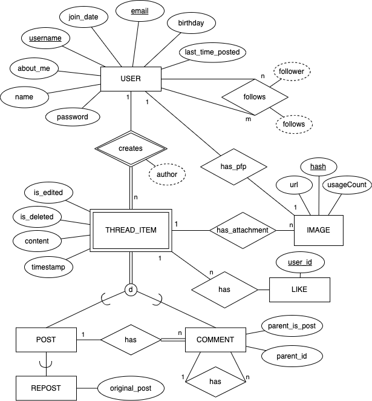
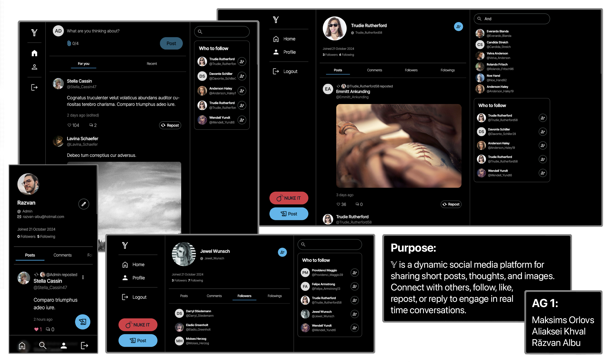

# Backend and Frontend Template

Latest version: https://git.chalmers.se/courses/dit342/group-00-web

This template refers to itself as `group-00-web`. In your project, use your group number in place of `00`.

## Project Structure

| File        | Purpose           | What you do?  |
| ------------- | ------------- | ----- |
| `server/` | Backend server code | All your server code |
| [server/README.md](server/README.md) | Everything about the server | **READ ME** carefully! |
| `client/` | Frontend client code | All your client code |
| [client/README.md](client/README.md) | Everything about the client | **READ ME** carefully! |
| [docs/LOCAL_DEPLOYMENT.md](docs/LOCAL_DEPLOYMENT.md) | Local production deployment | Deploy your app local in production mode |

## Requirements

The version numbers in brackets indicate the tested versions but feel free to use more recent versions.
You can also use alternative tools if you know how to configure them (e.g., Firefox instead of Chrome).

* [Git](https://git-scm.com/) (v2) => [installation instructions](https://www.atlassian.com/git/tutorials/install-git)
  * [Add your Git username and set your email](https://docs.gitlab.com/ce/gitlab-basics/start-using-git.html#add-your-git-username-and-set-your-email)
    * `git config --global user.name "YOUR_USERNAME"` => check `git config --global user.name`
    * `git config --global user.email "email@example.com"` => check `git config --global user.email`
  * > **Windows users**: We recommend to use the [Git Bash](https://www.atlassian.com/git/tutorials/git-bash) shell from your Git installation or the Bash shell from the [Windows Subsystem for Linux](https://docs.microsoft.com/en-us/windows/wsl/install-win10) to run all shell commands for this project.
* [Chalmers GitLab](https://git.chalmers.se/) => Login with your **Chalmers CID** choosing "Sign in with" **Chalmers Login**. (contact [support@chalmers.se](mailto:support@chalmers.se) if you don't have one)
  * DIT342 course group: https://git.chalmers.se/courses/dit342
  * [Setup SSH key with Gitlab](https://docs.gitlab.com/ee/ssh/)
    * Create an SSH key pair `ssh-keygen -t ed25519 -C "email@example.com"` (skip if you already have one)
    * Add your public SSH key to your Gitlab profile under https://git.chalmers.se/profile/keys
    * Make sure the email you use to commit is registered under https://git.chalmers.se/profile/emails
  * Checkout the [Backend-Frontend](https://git.chalmers.se/courses/dit342/group-00-web) template `git clone git@git.chalmers.se:courses/dit342/group-00-web.git`
* [Server Requirements](./server/README.md#Requirements)
* [Client Requirements](./client/README.md#Requirements)

## Getting started

```bash
# Clone repository
git clone git@git.chalmers.se:courses/dit342/group-00-web.git

# Change into the directory
cd group-00-web

# Setup backend
cd server && npm install
npm run dev

# Setup frontend
cd client && npm install
npm run serve
```

> Check out the detailed instructions for [backend](./server/README.md) and [frontend](./client/README.md).

## Visual Studio Code (VSCode)

Open the `server` and `client` in separate VSCode workspaces or open the combined [backend-frontend.code-workspace](./backend-frontend.code-workspace). Otherwise, workspace-specific settings don't work properly.

## System Definition (MS0)

### Purpose

𝕐 is a social media platform where users share short posts, containing text and optionally images. It can be used for sharing thoughts and media (images). People follow each other to see posts in their feed, and can like, repost, or reply to posts to engage in discussions.

### Pages

* **Authentication:** This includes pages for login, registering and restoring accounts. Users will be able to login using their username and password. To register a new user will need to fill out their username, password, name, e-mail and birthday. Furthermore, users can recover lost accounts by resetting their passwords using the e-mail address associated with their account.

* **Home:** Home page is the primary source of content on the platform. It provides infinetely scrolling feeds, both for activity from people you follow and general Y activity. This is also the place to go if you want to post something new.

* **Thread:** When an individual post or comment is opened, the item's content is shown at the top of the page, followed by the comment thread. Each post and comment can be replied to and liked. Threads can be unwound both ways, and depeneding on who is viewing, change layout (e.g. original poster can edit their own posts and comments)

* **Profile:** On this page a user can view any profile on the platform, whether it's someone else’s or their own. At the top of the page the user’s information (such as name, profile picture, about section, etc.) is displayed. If the user is viewing their own profile, they can edit their information. Below the info section, the user’s posts, as well as re-posts and comments are put into a feed in chronological order (newest first). The profile feed has the same functionality as the home feed (liking, commenting, reposting). The user can also follow another user on this page.

* **Discover:** This is the platform's search page. On desktop, it takes the form of a persistent side-bar; on mobile, it becomes its own tab in the navigation. Discover provides suggestions on who to follow and allows users to easily find old friends, or get in touch with anyone else on the platform.

### Entity-Relationship (ER) Diagram



## Backend (MS1)
### Endpoints
#### Feed
- GET /api/v1/feeds/

#### Password restoration
- POST /api/v1/restorePassword

#### Login
- POST /api/v1/login

#### Images
- GET /api/v1/images
- GET /api/v1/images/:hash
- DELETE /api/v1/images/:hash
- DELETE /api/v1/images

#### Users
- GET /api/v1/users/search
- GET /api/v1/users
- GET /api/v1/users/:username
- GET /api/v1/users/:username/suggestions
- GET /api/v1/users/:id/profile_picture
- GET /api/v1/users/:username/followers
- GET /api/v1/users/:username/followings
- GET /api/v1/users/:username/posts
- GET /api/v1/users/:username/comments
- POST /api/v1/users
- POST /api/v1/users/followings/:target_username
- PUT /api/v1/users/:id/profile_picture
- PUT /api/v1/users/:id
- PATCH /api/v1/users/:id
- DELETE /api/v1/users
- DELETE /api/v1/users/:id
- DELETE /api/v1/users/:id/profile_picture
- DELETE /api/v1/users/followings/:following_id

#### Posts
- GET /api/v1/posts
- GET /api/v1/posts/:id
- GET /api/v1/posts/:post_id/likes/:user_id
- POST /api/v1/posts/
- POST /api/v1/posts/repost
- POST /api/v1/posts/:post_id/likes/
- PUT /api/v1/posts/:id
- PATCH /api/v1/posts/:id
- DELETE /api/v1/posts
- DELETE /api/v1/posts/:id
- DELETE /api/v1/posts/:post_id/likes/:user_id

#### Comments
- GET /api/v1/comments/:id
- GET /api/v1/comments/:comment_id/likes/:user_id
- POST /api/v1/comments
- POST /api/v1/comments/:comment_id/likes
- PUT /api/v1/comments/:id
- PATCH /api/v1/comments/:id
- DELETE /api/v1/comments/:id
- DELETE /api/v1/comments/:comment_id/likes/:user_id

## Advanced Feature
  Our advanced feature is feed generation. Each user will have a personalized feed generated based on their followings, accessible on the homepage under ‘Feed’ tab. The feed is composed on the server side. On the backend, the feature has its own endpoint (‘api/v1/feeds’) that returns the most recent posts from people you are following, sorted chronologically. Furthermore, the endpoint also supports descendent sorting and pagination.

  On frontend, the feed is the central part of the website, infinitely scrollable, without the need for users to switch pages manually. More data provided through HATEOAS queries is loaded once the user reaches the end of the scrollable list. With this, loading is more efficient for larger lists, as the client requests only parts of the feed, not the whole. 

  Additionally, alongside the ‘Feed’ tab, there is a ‘Recents’ tab providing fresh posts from all platform's users (followed or not) through the same infinite scrolling list functionality described above.

## Teaser (MS3)


